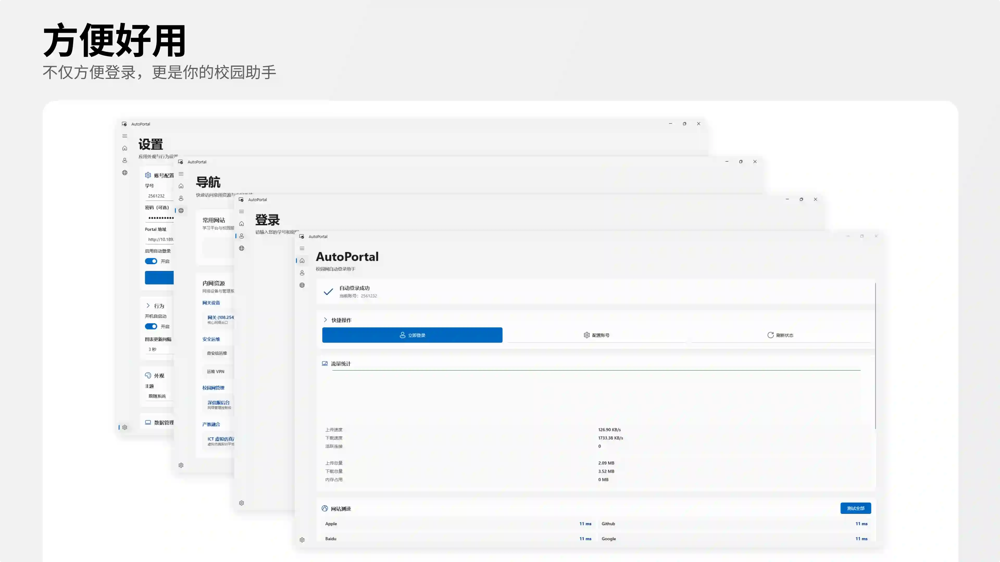
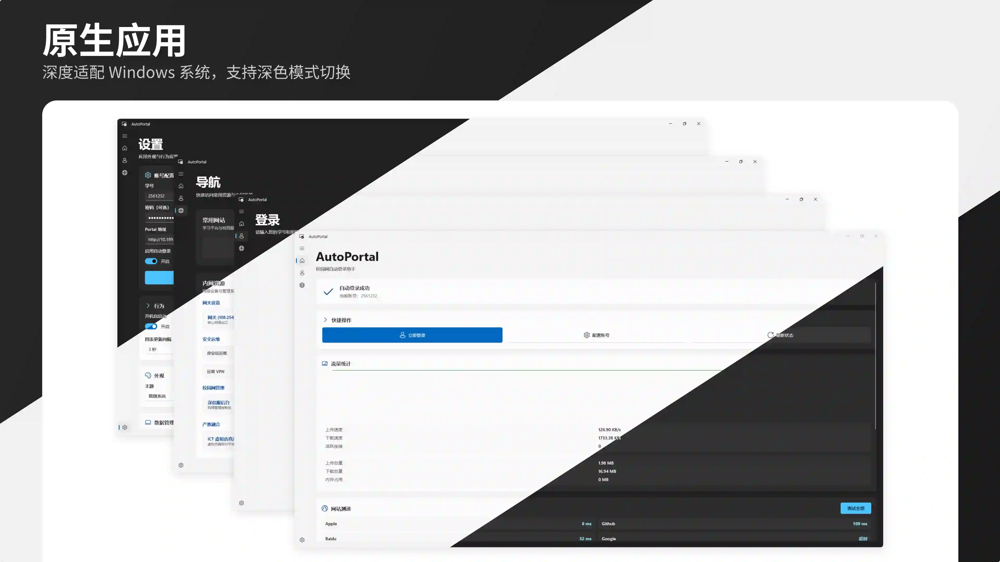

# GZITVS-CamA


**Guangzhou Information Technology Vocational School Campus Assistant**

## 简介

GZITVS-CamA 是一个基于 WinUI 3 的校园网 Portal 自动登录工具，集成了网络管理、系统优化、校园网助手等功能，为广州市信息技术职业学校的师生提供一站式校园网络助手。

> **适用学校**：广州市信息技术职业学校校园网

## 功能特性

### 网络管理
- ✅ 校园网 Portal 自动登录
- ✅ 开机自启动，网络就绪即刻登录
- ✅ 记住密码，安全便捷
- ✅ 实时网络状态监控
- ✅ 流量统计可视化
- ✅ IP 信息实时显示
- ✅ 网络连通性测试

### 界面体验
- ✅ 现代化 WinUI 3 设计语言
- ✅ Mica 材质效果，沉浸体验
- ✅ 深色/浅色主题，自由切换
- ✅ 自定义卡片布局，拖拽排序
- ✅ 流畅动画，极致丝滑

### 工具集成
- ✅ 极域助手 - 课堂工具辅助
- ✅ 系统助手 - 系统信息查看
- ✅ 校园网助手 - 网络状态与代理管理

### 性能优势
- ✅ 轻量级设计，启动迅速
- ✅ 原生代码，极致优化
- ✅ 低资源占用，稳定运行

详细功能请查看 [功能特性文档](docs/FEATURES.md)

## 应用截图


不仅方便登录，更是你的校园助手


深度适配 Windows 系统，支持深色模式切换

## 快速开始

### 安装

从 [GitHub Releases](https://github.com/worable233/GZITVS-CamA/releases) 下载最新安装包。

提供三种架构版本：
- **x64**：适用于 64 位 Windows 系统（推荐）
- **x86**：适用于 32 位 Windows 系统
- **ARM64**：适用于 ARM 架构 Windows 设备

详细安装说明请查看 [安装指南](docs/INSTALL.md)

### 首次使用

1. 启动 GZITVS-CamA
2. 进入「设置」页面，配置学号和密码
3. 开启「自动登录」和「开机自启动」（可选）
4. 连接校园网后，即可在首页一键登录

### 日常使用

- 打开应用后，若已配置自动登录，系统会自动检测校园网并尝试登录
- 首页实时显示网络状态、流量统计、IP 信息
- 每次打开都会随机显示一条实用提示

详细使用说明请查看 [使用指南](docs/USAGE.md)

## 构建

### 环境要求

- Windows 10/11
- Visual Studio 2022 (带 C++ 桌面开发工作负载)
- .NET 8.0 SDK
- Windows App SDK 1.8.2

```bash
# 还原依赖
dotnet restore

# 构建
dotnet build

# 运行
dotnet run

# 发布 (x64)
dotnet publish -c Release -r win-x64
```

详细构建说明请查看 [构建指南](docs/BUILD.md)

## 项目结构

```
GZITVS-CamA/
├── App.xaml(.cs)          # 应用程序入口与生命周期管理
├── MainWindow.xaml(.cs)   # 主窗口，含导航栏
├── Pages/                 # 页面文件夹
│   ├── HomePage.xaml      # 首页：状态面板、快捷操作、流量图表
│   ├── LoginPage.xaml     # 登录页：Portal 登录与状态管理
│   ├── SettingsPage.xaml  # 设置页：账号配置、外观、行为
│   ├── NetworkCheckPage.xaml  # 网络诊断页
│   ├── NavigationPage.xaml    # 网络导航工具
│   └── OptimizationPage.xaml  # 优化工具集
├── Services/              # 业务服务层
│   ├── NavigationService      # 页面导航
│   ├── AppSettingsService     # 应用设置管理
│   └── LoggerService          # 日志服务
├── Helpers/               # 工具类
│   ├── LoginValidator         # 登录逻辑与配置
│   └── NativeDllExtractor     # 原生 DLL 提取器
├── Login/                 # 原生 C++ 登录库
└── Resources/             # 样式与资源
```

## 技术栈

- **UI 框架**: WinUI 3 (Windows App SDK 1.8.2)
- **运行时**: .NET 8.0
- **编程语言**: C# 12 & C++ 17
- **图表库**: LiveChartsCore (SkiaSharp)
- **原生库**: libcurl (网络请求)
- **安装包**: Inno Setup 7

## 许可证

[Attribution-NonCommercial-ShareAlike 4.0 International (CC BY-NC-SA 4.0)](LICENSE)

---

**文档索引**：
- [功能特性](docs/FEATURES.md)
- [安装指南](docs/INSTALL.md)
- [使用指南](docs/USAGE.md)
- [构建指南](docs/BUILD.md)
- [打包总结](PACKAGING_SUMMARY.md)
